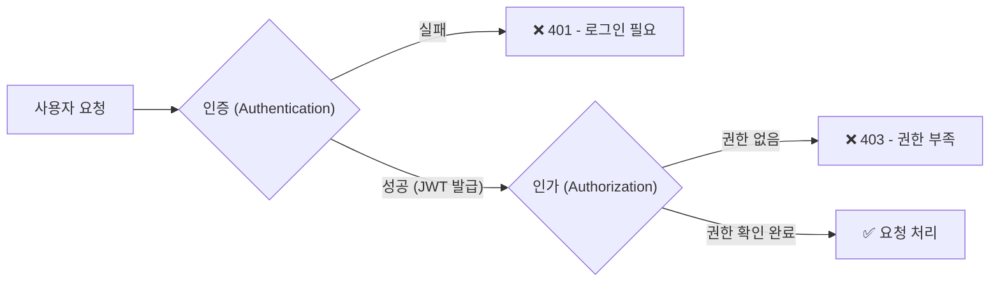
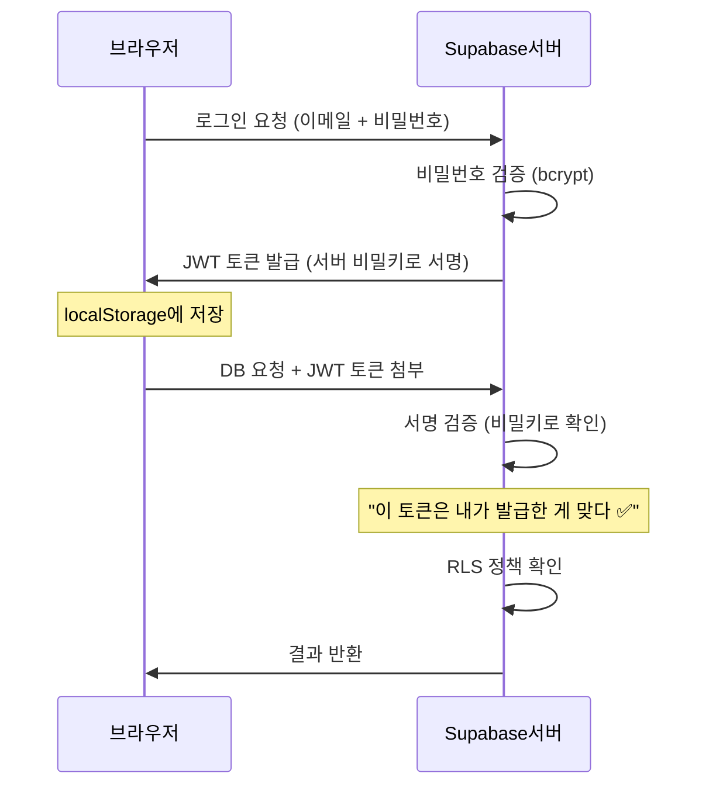
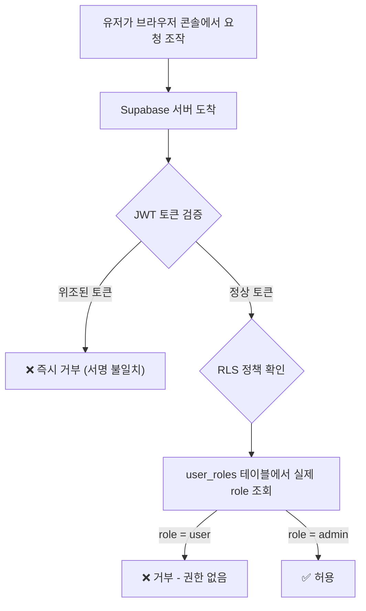
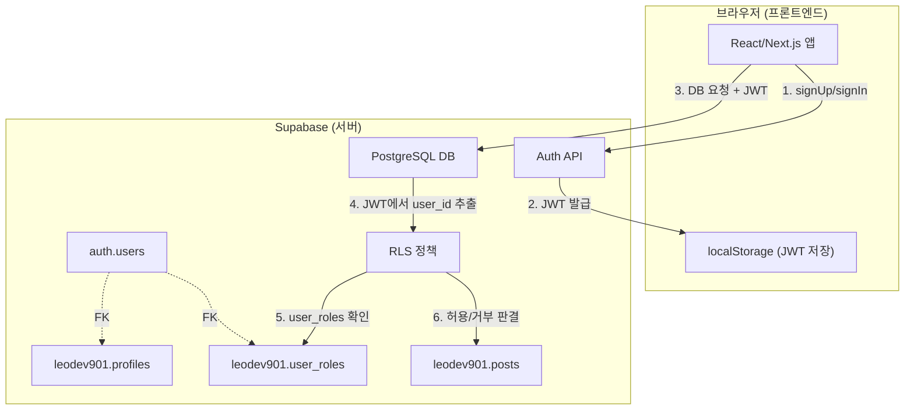

# 🔒 Step 10 심화: 인증 / 인가 / 보안 패턴 완전 정복

> **이 문서는 Step 10 학습 과정에서 나온 깊이 있는 질문과 답변을 재구성한 심화 가이드입니다.**
> 인증(Authentication), 인가(Authorization), JWT, RLS, RBAC 등 실무 보안 패턴을 다룹니다.

---

## 1. 인증(Authentication) vs 인가(Authorization) 개념 정리

| 구분 | 인증 (Authentication) | 인가 (Authorization) |
|------|:---:|:---:|
| **질문** | "너 누구야?" | "너 이거 할 수 있어?" |
| **예시** | 로그인 (이메일 + 비밀번호) | 관리자만 글 삭제 가능 |
| **실패 시** | 401 Unauthorized | 403 Forbidden |
| **Supabase 담당** | `supabase.auth` | RLS Policy |



---

## 2. JWT 토큰의 동작 원리

### JWT란?
**JSON Web Token**의 약자로, 유저의 신원 정보를 담은 **디지털 출입증**입니다.

### 구조 (3파트)
```
eyJhbGciOiJIUzI1NiJ9.eyJzdWIiOiJhYmMxMjMifQ.서명값
 ──── Header ────  ──── Payload ─────  ── Signature ──
```

| 파트 | 역할 | 내용 예시 |
|------|------|----------|
| **Header** | 암호화 방식 | `{"alg": "HS256"}` |
| **Payload** | 유저 정보 | `{"sub": "user-uuid", "role": "anon", "exp": 1700000000}` |
| **Signature** | 위조 방지 서명 | Supabase 서버의 비밀 키로 생성 (클라이언트는 모름!) |

### 왜 위조가 불가능한가?


> **핵심:** Signature(서명)는 서버만 가지고 있는 비밀 키로 만듭니다. 유저가 Payload를 수정하면 서명이 맞지 않아 서버가 즉시 거부합니다!

### JWT 저장 위치
브라우저 F12 → Application → Local Storage:
```
키: sb-xxxx-auth-token
값: {
    "access_token": "eyJhbGciOiJIUzI1...",   ← JWT (보통 1시간 유효)
    "refresh_token": "v1.abc123...",          ← 갱신용 토큰
    "expires_at": 1700000000
}
```

---

## 3. `supabase.auth` 라이브러리 = 풀 패키지

`supabase.auth`는 우리가 직접 짜야 할 것들을 모두 대신 해주는 인증 전용 라이브러리입니다.

### 우리 코드에서 쓰는 것 vs Supabase가 자동으로 해주는 것

| 기능 | 직접 짜야 하나? | 설명 |
|------|:---:|------|
| 회원가입 / 로그인 / 로그아웃 | ❌ | `supabase.auth` 그대로 사용 |
| 세션 / 토큰 / localStorage | ❌ | SDK가 자동 관리 |
| 비밀번호 암호화 (bcrypt) | ❌ | 서버에서 자동 처리 |
| 이메일 중복 체크 | ❌ | `auth.users`에 UNIQUE 제약 조건 |
| `User` 타입 Interface | ❌ | `@supabase/supabase-js`에 내장 |
| DB 요청 시 JWT 전송 | ❌ | SDK가 자동으로 붙여서 전송 |
| `profiles` / `user_roles` 테이블 | ✅ | SQL로 직접 만들기 |
| 회원가입 후 profiles INSERT | ✅ | TSX에서 추가 코드 작성 |
| RLS 정책 작성 | ✅ | SQL로 정책 등록 |

---

## 4. 추가 유저 정보 저장: 두 가지 방법

### 방법 A: `user_metadata` (간편)
```tsx
// 회원가입 시 추가 정보를 같이 저장
const { data, error } = await supabase.auth.signUp({
    email, password,
    options: {
        data: { display_name: '레오', username: 'leodev901' }
    }
});

// 나중에 꺼내 쓰기
const user = (await supabase.auth.getUser()).data.user;
console.log(user.user_metadata.display_name); // '레오'
```

### 방법 B: `profiles` 테이블 (실무)

```
auth.users (Supabase 자동 관리)       leodev901.profiles (우리가 설계)
┌──────────┬──────────────────┐      ┌──────────┬──────────┬─────────┐
│ id (UUID)│ email            │─FK──▶│ user_id  │ nickname │ bio     │
│ abc123   │ leo@example.com  │      │ abc123   │ 레오     │ 개발자  │
└──────────┴──────────────────┘      └──────────┴──────────┴─────────┘
```

```sql
CREATE TABLE leodev901.profiles (
    user_id UUID PRIMARY KEY REFERENCES auth.users(id),
    nickname TEXT,
    bio TEXT,
    avatar_url TEXT
);
```

| 비교 | `user_metadata` | `profiles` 테이블 |
|------|:---:|:---:|
| 난이도 | 쉬움 ✅ | 중간 |
| 다른 유저 프로필 조회 | ❌ 불가 | ✅ 가능 |
| 검색 / 정렬 | ❌ 불가 | ✅ 가능 |
| 적합한 상황 | 학습, 프로토타입 | 실무, 상용 앱 |

---

## 5. RBAC (역할 기반 접근 제어) 구현 가이드

### 5-1. 역할 테이블 생성

```sql
CREATE TABLE leodev901.user_roles (
    id UUID PRIMARY KEY DEFAULT gen_random_uuid(),
    user_id UUID REFERENCES auth.users(id),
    role TEXT NOT NULL DEFAULT 'user'  -- 'user', 'admin', 'moderator'
);
```

### 5-2. 회원가입 후 역할 자동 등록

**방법 A: 프론트엔드(TSX)에서 직접** (학습/프로토타입용)
```tsx
const handleSignUp = async () => {
    const { data, error } = await supabase.auth.signUp({ email, password });
    if (error || !data.user) return;

    // 회원가입 성공 후, 역할 테이블에 'user'로 INSERT
    await supabase.from('user_roles').insert({
        user_id: data.user.id,
        role: 'user',  // 무조건 'user'로 고정
    });
};
```

**방법 B: Database Trigger** (실무용 — 서버 내부에서 자동 실행되어 조작 불가)
```sql
CREATE FUNCTION public.handle_new_user()
RETURNS TRIGGER AS $$
BEGIN
    INSERT INTO leodev901.profiles (user_id, nickname)
    VALUES (NEW.id, NEW.raw_user_meta_data->>'display_name');

    INSERT INTO leodev901.user_roles (user_id, role)
    VALUES (NEW.id, 'user');  -- 무조건 'user'! (보안 ✅)

    RETURN NEW;
END;
$$ LANGUAGE plpgsql;

CREATE TRIGGER on_auth_user_created
    AFTER INSERT ON auth.users
    FOR EACH ROW EXECUTE FUNCTION public.handle_new_user();
```

### 5-3. RLS 정책으로 역할별 접근 제어

```sql
-- 예: "본인 글이거나, admin만 삭제 가능"
CREATE POLICY "Only owner or admin can delete" ON leodev901.posts
FOR DELETE USING (
    auth.uid() = user_id                    -- 내가 쓴 글이거나
    OR EXISTS (                             -- 내가 admin이거나
        SELECT 1 FROM leodev901.user_roles
        WHERE user_id = auth.uid() AND role = 'admin'
    )
);
```

### 5-4. 프론트에서 역할 확인 (UI 조건부 렌더링)
```tsx
const { data } = await supabase
    .from('user_roles')
    .select('role')
    .eq('user_id', user.id)
    .single();

if (data?.role === 'admin') {
    // 🔴 삭제 버튼 보여주기 (UI 편의)
}
```

---

## 6. "프론트에서 조작하면?" — 보안의 두 겹 구조

> **Q.** 프론트에서 콘솔로 `role: 'admin'`을 보내면 뚫리지 않나요?
>
> **A.** ❌ 절대 뚫리지 않습니다! 핵심은 **RLS가 DB 레벨에서 최종 판결**을 내리기 때문입니다.



### 핵심 포인트

| 공격 시도 | 결과 | 이유 |
|----------|:---:|------|
| 프론트 코드에서 `role` 변수값 수정 | ❌ 실패 | RLS는 프론트 변수를 안 봄. DB에서 직접 조회 |
| JWT 토큰의 Payload 수정 | ❌ 실패 | Signature(서명)가 불일치하여 서버가 거부 |
| `user_roles` 테이블 직접 UPDATE | ❌ 실패 | RLS 정책: "admin만 UPDATE 가능" |
| 새 JWT 위조 | ❌ 실패 | 서버 비밀 키 없이는 서명 생성 불가 |

---

## 7. 권한 업그레이드는 어떻게?

**권한 변경은 절대 프론트를 거치지 않습니다:**

| 방법 | 사용 주체 | 보안 |
|------|----------|:---:|
| Supabase 대시보드 SQL Editor에서 직접 UPDATE | 개발자/슈퍼 관리자 | ✅ 최고 |
| Service Role Key를 사용하는 백엔드 API | 서버 (Node.js 등) | ✅ 높음 |
| RLS로 보호된 "admin 전용" 어드민 페이지 | 웹 관리자 페이지 | ✅ 높음 |
| ~~프론트엔드에서 직접 UPDATE~~ | ~~일반 유저~~ | ❌ 위험 |

> **Service Role Key**는 RLS를 무시할 수 있는 "마스터 키"입니다. 이 키는 절대 프론트에 노출되면 안 되고, 백엔드 서버에서만 사용합니다.

---

## 8. 실무 아키텍처 전체 그림



### 요약: 누가 무엇을 담당하나?

| 계층 | 담당 | 예시 |
|------|------|------|
| **Auth (인증)** | Supabase Auth SDK | `signUp`, `signIn`, JWT 발급 |
| **UI (화면)** | React 조건부 렌더링 | `if (role === 'admin')` → 삭제 버튼 표시 |
| **보안 (진짜)** | PostgreSQL RLS | `auth.uid()` + `user_roles` 테이블 확인 |

> 💡 **프론트 = 편의, DB = 보안.** 이 원칙만 기억하면 됩니다!
